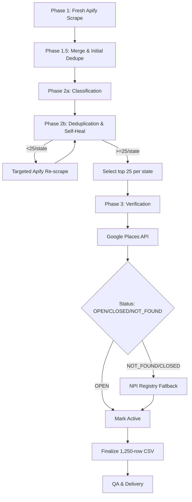

# Pharmacy Verification Project - Development Plan

## 1. Introduction & Project Goal

**Objective**: This document outlines the development roadmap for completing the Independent Pharmacy Verification project. It is intended for a new development team taking over the project.

**Goal**: To deliver a verified CSV file containing approximately 1,250 active, independent pharmacies (around 25 per state) with high-confidence mailing addresses.

**Current State**: The project has a solid foundation with several core modules implemented and well-tested. However, there are critical gaps in the main pipeline orchestration, data processing, and verification logic that prevent an end-to-end run. This plan details the remaining work required to achieve the project goal.

## 2. Target Architecture

The final system will follow a sequential pipeline orchestrated by `scripts/run_pipeline.py`:



## 3. Development Roadmap

This roadmap is broken into four phases, addressing all identified gaps.

### Phase 1: Foundational Scaffolding & Initial Data Processing

*Goal: Create all missing files/directories and implement the first step of the data pipeline.*

*   **Task 1.1: Create Missing Directories**
    *   **Action**: Create the `docs/` and `reports/` directories in the project root.
    *   **Purpose**: These are required for storing documentation and run artifacts as specified in the project manifest.

*   **Task 1.2: Implement Initial Data Merging**
    *   **Action**: Create and implement the script `src/dedup_self_heal/merge_and_dedupe.py`.
    *   **Requirements**:
        *   It should accept a list of raw data file paths (from the initial Apify scrape).
        *   It must merge all records from these files into a single DataFrame.
        *   It must remove duplicate pharmacies based on the `placeId` column.
        *   It should save the cleaned, merged data to a new CSV file (e.g., `data/processed/01_merged_pharmacies.csv`).
    *   **Testing**: Add unit tests to `tests/test_dedup_self_heal.py` to verify merging and deduplication logic.

*   **Task 1.3: Populate Makefile**
    *   **Action**: Add an initial `make merge_data` command to the `Makefile`.
    *   **Purpose**: To provide a simple command-line interface for running the initial merge script.

### Phase 2: Core Pipeline Orchestration

*Goal: Implement the main pipeline script to connect the existing, functional modules.*

*   **Task 2.1: Implement `scripts/run_pipeline.py`**
    *   **Action**: Flesh out the `run_pipeline.py` script to be the main entrypoint.
    *   **Requirements**:
        1.  Load a configuration file (e.g., `config/large_scale_run.json`).
        2.  **Step 1 (Scrape)**: Call the `ApifyCollector` to run the fresh scrape based on the config.
        3.  **Step 2 (Merge)**: Call the newly created `merge_and_dedupe.py` script to process the raw output.
        4.  **Step 3 (Classify)**: Use the `Classifier` to tag pharmacies as "chain" or "independent".
        5.  **Step 4 (Dedupe & Self-Heal)**: Use the `Deduplicator` to count independents per state and trigger the self-heal re-scrape loop until all states meet the target of 25.
        6.  **Step 5 (Verification)**: Pass the final list of ~1,250 pharmacies to the `GooglePlacesVerifier`.
    *   **Note**: For now, the NPI fallback will be skipped. The script should save the output after the Google Places step.

### Phase 3: Complete the Verification Flow

*Goal: Implement and integrate the NPI Registry fallback for robust verification.*

*   **Task 3.1: Create `src/verification/npi_client.py`**
    *   **Action**: Create the new file and implement a client for the NPPES NPI Registry API.
    *   **Requirements**:
        *   The client should have a method that takes a pharmacy name and address and returns verification status from the NPI registry.
        *   It should handle API errors gracefully.
    *   **Testing**: Create `tests/test_npi_client.py` with mocked API calls to test success and failure scenarios.

*   **Task 3.2: Integrate NPI Fallback into Pipeline**
    *   **Action**: Modify `run_pipeline.py`.
    *   **Logic**: For any pharmacy marked as `CLOSED` or `NOT_FOUND` by the Google Places API, the pipeline should call the `NPIClient` to perform a fallback lookup. The final status should be updated based on the NPI result.

### Phase 4: Finalization, Documentation, and Testing

*Goal: Complete all supporting artifacts and ensure the project is ready for production runs.*

*   **Task 4.1: Create Developer Documentation**
    *   **Action**: Create the file `docs/DEVELOPMENT.md`.
    *   **Content**: Document the full, end-to-end pipeline, including:
        *   How to set up the environment.
        *   Required environment variables (`APIFY_API_TOKEN`, `PERPLEXITY_API_KEY`, etc.).
        *   A step-by-step guide to running the entire pipeline using `make` commands.
        *   Descriptions of the key configuration files.

*   **Task 4.2: Finalize `Makefile`**
    *   **Action**: Add the remaining targets: `make scrape`, `make classify`, `make verify`, and a single `make run_all` that executes the full pipeline.

*   **Task 4.3: Create Staging Configuration**
    *   **Action**: Create the `config/five_state_run.json` file.
    *   **Purpose**: This will be used for mid-scale staging tests before a full national run.

*   **Task 4.4: Full Integration Test**
    *   **Action**: Execute a complete pipeline run using the `five_state_run.json` configuration.
    *   **Goal**: Verify that all modules work together correctly and produce the expected final CSV output for the five states.

## 4. Getting Started for the New Team

1.  **Clone the Repository**: `git clone ...`
2.  **Set up Virtual Environment**: `python -m venv venv` and `source venv/bin/activate`.
3.  **Install Dependencies**: `pip install -r requirements.txt`.
4.  **Set Environment Variables**: Create a `.env` file in the root directory and add the necessary API keys:
    ```
    APIFY_API_TOKEN="your_token_here"
    PERPLEXITY_API_KEY="your_key_here"
    GOOGLE_MAPS_API_KEY="your_key_here"
    ```
5.  **Run the Test Suite**: Run `pytest` to ensure the existing modules are functioning correctly.
6.  **Begin with Phase 1** of the development roadmap.
