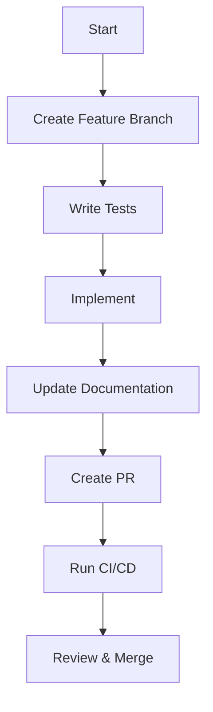
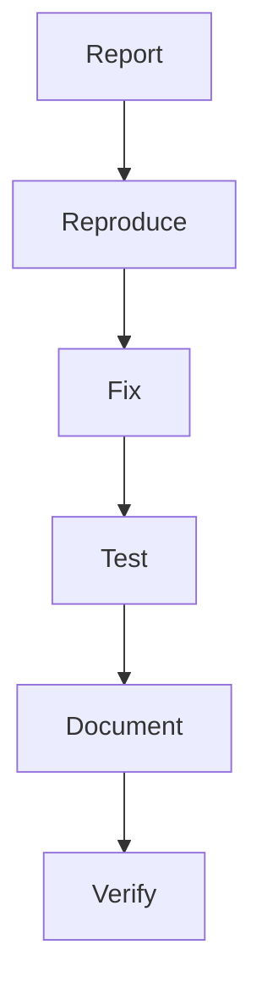

# AI IDE Interaction Standard Operating Procedure (SOP)

## Purpose
This document defines the standard operating procedures for interaction between the AI LLM IDE (Cascade) and the Pharmacy Scraper project, ensuring consistent and effective collaboration.

## 1. Initial Setup

### 1.1 Project Context Loading
- **Automatic Context Loading**: When starting a new session, Cascade should automatically load:
  - Project structure
  - Recent changes (last 5 commits)
  - Open issues and PRs
  - Current branch status

### 1.2 Template Awareness
- **Template Integration**: Cascade should be aware of and reference these templates:
  - `feature_request.md`
  - `bug_report.md`
  - `documentation_update.md`
- **Template Usage**: Automatically suggest relevant templates when user intent matches (e.g., "I found a bug" → bug report template)

## 2. Interaction Patterns

### 2.1 Code Generation
- **Context-Aware Suggestions**:
  - Reference existing patterns in the codebase
  - Follow project's coding standards
  - Include type hints and docstrings
- **Template Usage**:
  - For new features, reference the feature template
  - Include test stubs following project patterns

### 2.2 Issue Management
- **Issue Creation**:
  - Use template forms for consistency
  - Auto-populate environment details
  - Suggest related components based on code changes
- **Triage Workflow**:
  - Label issues appropriately
  - Reference existing similar issues
  - Suggest assignees based on code ownership

### 2.3 Documentation Updates
- **Auto-Documentation**:
  - Track code changes that need documentation
  - Suggest updates to relevant documentation
  - Follow documentation template structure
- **Knowledge Base**:
  - Maintain project knowledge in `pharmacy-project-digest.md`
  - Update when significant changes occur

## 3. Cascade-Specific Rules

### 3.1 Memory Management
- **Context Windows**:
  - Prioritize recent changes and active files
  - Maintain conversation history for context
  - Use memory system for important decisions

### 3.2 Tool Usage
- **Code Search**:
  - Use `codebase_search` before making changes
  - Check for similar implementations
- **File Operations**:
  - Always check file existence before editing
  - Use appropriate tools for file operations

### 3.3 Error Handling
- **Validation**:
  - Validate all inputs before execution
  - Provide clear error messages
  - Suggest fixes for common issues
- **Recovery**:
  - Maintain operation history
  - Support undo/redo where possible

## 4. Workflow Integration

### 4.1 Development Workflow
1. **Task Understanding**:
   - Clarify requirements
   - Break down into subtasks
   - Estimate complexity

2. **Implementation**:
   - Follow TDD approach
   - Create/update tests
   - Implement changes
   - Update documentation

3. **Review**:
   - Self-review changes
   - Run tests
   - Update documentation

### 4.2 Template-Specific Flows

#### Feature Development


#### Bug Fixing


## 5. Best Practices

### 5.1 Code Quality
- Follow PEP 8 guidelines
- Write self-documenting code
- Keep functions small and focused

### 5.2 Documentation
- Update docs with code changes
- Use consistent formatting
- Include examples

### 5.3 Testing
- Maintain high test coverage
- Test edge cases
- Update tests with changes

## 6. Cascade Rule Configuration

```yaml
# .cascade/rules/pharmacy_scraper.yaml
rules:
  - name: template-aware-assistance
    description: Provide template-based assistance for common tasks
    triggers:
      - intent: create_issue
        patterns: 
          - "create (bug|issue|ticket)"
          - "report a problem"
      - intent: new_feature
        patterns:
          - "add feature"
          - "implement new"
    actions:
      - suggest_template: "${intent}_template.md"
      - provide_guidance: "Consider including test cases and documentation updates"

  - name: code-review-assistant
    description: Assist with code reviews and quality checks
    triggers:
      - file_change: "*.py"
    actions:
      - run_linter: true
      - check_test_coverage: true
      - suggest_improvements: true

  - name: documentation-updater
    description: Keep documentation in sync with code changes
    triggers:
      - code_change: "*.py"
    actions:
      - check_docs: true
      - suggest_updates: true
      - auto_update: "non-breaking"
```

## 7. Maintenance

### 7.1 Review Cycle
- Monthly review of interaction patterns
- Update templates as needed
- Gather user feedback

### 7.2 Performance Metrics
- Track template usage
- Monitor issue resolution time
- Measure user satisfaction

## 8. Contact
For questions or updates to this SOP, contact: [Your Contact Information]
